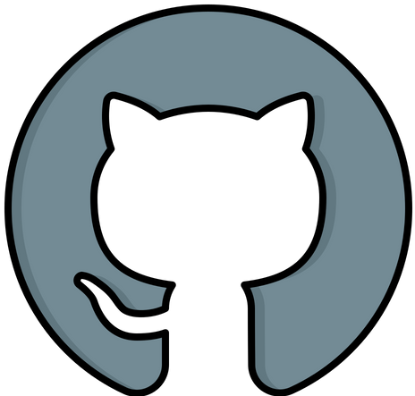
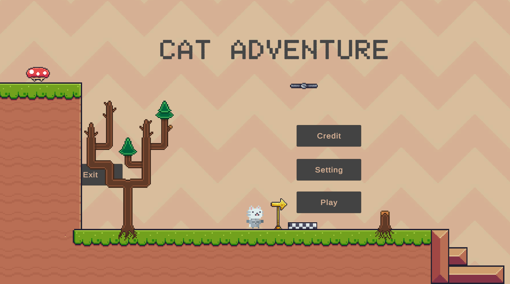

# Hi 
<h1 align="center">I'm JiMeow</h1>
<h3 align="center">A passionate GameDeveloper</h3>

<h3 align="left"> Languages and Tools:</h3>

 
 
 

<h3 align="left"> Contact Me:</h3>

 
 

    

<h3></h3>

 

 
