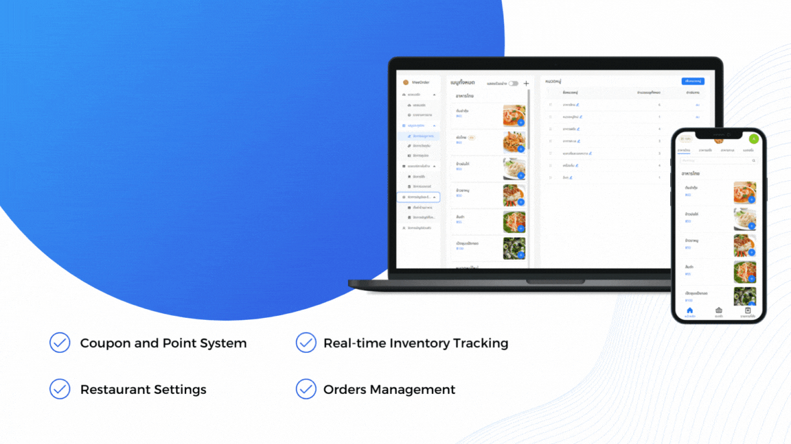
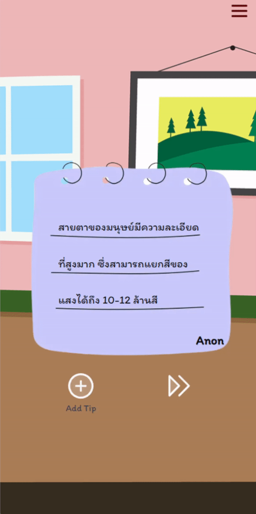
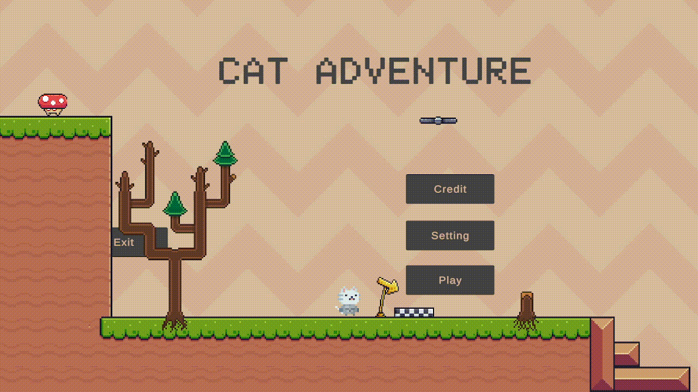

# Hi 
<h1 align="center" item="center">I'm JiMeow
</h1>

<h3 align="center" class="red">A passionate Developer</h3>
<h3 align="center" > <a href="https://jimeow-portfolio.vercel.app">My Portfolio </a></h3>

 

    <h3 style="">Game Development:</h3>
    

        &nbsp;&nbsp;&nbsp;&nbsp;
        
        
         
        
        
    

    <h3 style="">Website Development:</h3>
    

        &nbsp;&nbsp;&nbsp;&nbsp;
        
        
        
        
        
        
        
        
        
        
        
    

    <h3 style="">Programming Language:</h3>
    

        &nbsp;&nbsp;&nbsp;&nbsp;
         
         
         
        
        
        
        
    

<h3 align="left"> Contact Me:</h3>
&nbsp;&nbsp;&nbsp;&nbsp;

 
<h3 align="left"> MVP:</h3>

 
    &nbsp;&nbsp;&nbsp;&nbsp;
    

 
<h3 align="left"> Most WebDev Recent Project:</h3>

 
    &nbsp;&nbsp;&nbsp;&nbsp;
    

 
<h3 align="left"> Most GameDev Recent Project:</h3>

    &nbsp;&nbsp;&nbsp;&nbsp;
    

 
<h3 align="left"> Profile Stuff:</h3>

 

 

<h2></h2>

 
